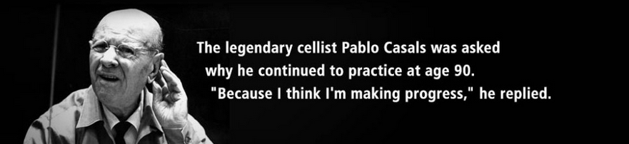

+++ 
draft = false
date = 2023-01-05T00:25:00+09:00
title = "프로그래밍, 초심, 그리고 파블로 카잘스"
description = ""
slug = ""
authors = []
tags = ["programming"]
categories = []
externalLink = ""
series = []
+++

## 파블로 카잘스의 일화

파블로 카잘스가 타계하기 한해 전인 그의 나이 95세 때에도 그는 하루에 여섯 시간씩 꾸준히 첼로 연습을 했다.

한 기자가 물었다.
> "아흔 다섯이시고 첼로의 성자이신데 왜 그렇게 연습하십니까?"

카잘스는 다음과 같이 대답했다.
> "왜냐면, 지금도 연습할 때마다 내 연주 실력이 조금씩 향상되고 있기 때문입니다."

## 나의 일화

한참 프로그래밍을 배우던 시절, 어느 수필집에서 이 글을 읽었다.
늦게 프로그래밍을 시작했고, 잘하고는 싶은데 실력이 잘 느는 것 같지 않다고 느끼던 때였다.
이 글 덕분에, 아직도 초심을 기억하고, 다시 프로그래밍 하게 된다.
컴퓨터로 -- 프로그래밍을 통해 -- 뭔가를 만들어 내는 것이 항상 나에게 큰 즐거움을 줄 것이라 굳게 믿던 시절이었다.
그리고, 언젠가는 정말 잘해서 뭔가를 만들어 내고 싶었을 때였다.
다시, 열심히 코딩 해야지.
